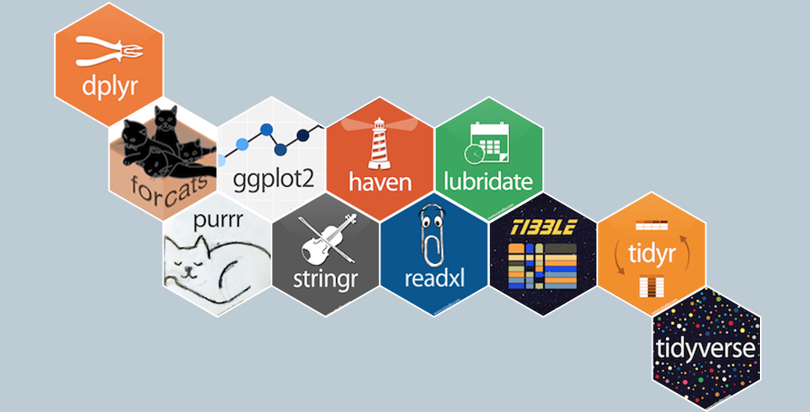

# Análisis de Datos con R para Ciencias Sociales — *analisisdatosR*

Curso práctico de 30 horas para la **Licenciatura en Estudios Internacionales**. Integra programación básica en R con principios de investigación reproducible y trabajo con datos reales. 

---

## Objetivo general
Desarrollar competencias fundamentales para explorar, analizar y presentar datos utilizando R/RStudio. 

## Objetivos específicos
**Módulo 1 — Fundamentos y ecosistema R.** Comprender las bases técnicas y conceptuales para el análisis de datos en R, manejando importación de datos desde distintas fuentes y aplicando los principios fundamentales del ecosistema tidyverse para la exploración de datasets reales.

**Módulo 2 — Manipulación de datos.** Desarrollar competencias de manipulación de datos que permitan transformar, agregar y reestructurar información, integrando distintas fuentes de datos para desarrollar análisis descriptivo.  

**Módulo 3 — Visualización con ggplot2.** Crear visualizaciones efectivas usando la gramática de gráficos; personalización y exportación.   
 
**Módulo 4 — Análisis aplicado y comunicación.** Correlaciones/Regresiones (interpretación), tablas profesionales y reportes reproducibles con R Markdown. 

---

## Calendario (10 sesiones × 3 h)

| Sesión | Tema | Contenido | Material |
|---|---|---|---|
| 1 | Setup + R/RStudio | Proyecto, objetos básicos, importar CSV/Excel/SPSS | [Slides](slides/clase_1.html)|
| 2 | Tidyverse I | `dplyr`: select/filter/mutate/summarise/group_by | [Slides](slides/02-tidyverse.html)  |
| 3 | Tidyverse II | `tidyr`: pivot_wider/longer; `readr`; `janitor` | [Slides](slides/03-tidyr.html)  |
| 4 | Joins | Integración de múltiples fuentes (left/right/inner/full) | [Slides](slides/04-joins.html) |
| 5 | Viz I | Gramática de gráficos; barras/líneas/boxplots | [Slides](slides/05-ggplot-basico.html)  |
| 6 | Viz II | Facetas, escalas, temas; exportación | [Slides](slides/06-ggplot-avanzado.html)  |
| 7 | Tablas y reportes | `gt`/`gtsummary`; R Markdown (reportes/slides) | [Slides](slides/07-reportes.html) |
| 8 | Análisis aplicado | Descriptivos, correlaciones; briefing gráfico | [Slides](slides/08-analisis.html) |
| 9 | Regresión básica | Lineal/logística (interpretación no causal) | [Slides](slides/09-modelos.html)|
| 10 | Proyecto final | Integración: script + slides + visualizaciones | [Slides](slides/10-proyecto.html) |

---

## Estructura del repositorio
- `slides/` — presentaciones (xaringan )
- `lectures/` — scripts/notebooks por clase
- `exercises/` — ejercicios 
- `data/` — `raw/` y `processed/`
- `images/` — gráficos e ilustraciones

---

## Evaluación
- Evaluación 1 (Módulo 1) — 25%  
- Evaluación 2 (Módulo 2) — 25%  
- Evaluación 3 (Módulo 3) — 20%  
- Evaluación 4 (Tarea Final) — 30%  

---

## Bibliografía clave (acceso abierto)
- Wickham, H., & Grolemund, G. (2017). **R for Data Science: Import, Tidy, Transform, Visualize,and Model Data.** O’Reilly Media. Disponible en: https://r4ds.had.co.nz/
- Imai, K. (2017). **Quantitative Social Science: An Introduction** Princeton University Press. Dis￾ponible en: https://qss.princeton.press/
- Wickham, H. (2016). **ggplot2: Elegant Graphics for Data Analysis.** Springer. Disponible en:https://ggplot2-book.org/
-

