```{r setup, include=FALSE}
options(htmltools.dir.version = FALSE)
knitr::opts_chunk$set(warning = FALSE, message = FALSE)
```

```{r xaringan-themer, include=FALSE, warning=FALSE}
library(xaringanthemer)
style_duo_accent(
  footnote_font_size = "0.5em",
  primary_color = "#28282B",
  #primary_color = "#7393B3",
  secondary_color = "#2c8475",
  black_color = "#4242424",
  white_color = "#FFF",
  base_font_size = "30px",
  # text_font_family = "Jost",
  # text_font_url = "https://indestructibletype.com/fonts/Jost.css",
  header_font_google = google_font("Libre Franklin", "200", "400"),
  header_font_weight = "200",
  inverse_header_color = "#eaeaea",
  title_slide_text_color = "#FFFFFF",
  text_slide_number_color = "#9a9a9a",
  text_bold_color = "#6A5ACD",
  code_inline_color = "#B56B6F",
  code_highlight_color = "transparent",
  link_color = "#2c8475",
  table_row_even_background_color = lighten_color("#345865", 0.9),
  extra_fonts = list(
    "https://indestructibletype.com/fonts/Jost.css",
    google_font("Amatic SC", "400")
  ),
  colors = c(
    green = "#31b09e",
    "green-dark" = "#2c8475",
    highlight = "#87f9bb",
    purple = "#887ba3",
    pink = "#B56B6F",
    orange = "#f79334",
    red = "#dc322f",
    `blue-dark` = "#002b36",
    `text-dark` = "#202020",
    `text-darkish` = "#424242",
    `text-mild` = "#606060",
    `text-light` = "#9a9a9a",
    `text-lightest` = "#eaeaea"
  ),
  extra_css = list(
    ".remark-slide-content h3" = list(
      "margin-bottom" = 0, 
      "margin-top" = 0
    ),
    ".smallish, .smallish .remark-code-line" = list(`font-size` = "0.7em")
  )
)
suppressWarnings(xaringanExtra::use_xaringan_extra(c("tile_view", "animate_css", "tachyons", "share_again")))
suppressWarnings(xaringanExtra::use_extra_styles())

```

```{r metadata, echo=FALSE}
library(metathis)
meta() %>% 
  meta_description("Análisis R Studio") %>% 
  meta_social(
    title = "Análisis R Studio",
    url = "",
    image = "",
    twitter_card_type = "summary_large_image",
    twitter_creator = "vgonzalez"
  )
```


```{r components, include=FALSE}
slides_from_images <- function(
  path,
  regexp = NULL,
  class = "hide-count",
  background_size = "contain",
  background_position = "top left"
) {
  if (isTRUE(getOption("slide_image_placeholder", FALSE))) {
    return(glue::glue("Slides to be generated from [{path}]({path})"))
  }
  if (fs::is_dir(path)) {
    imgs <- fs::dir_ls(path, regexp = regexp, type = "file", recurse = FALSE)
  } else if (all(fs::is_file(path) && fs::file_exists(path))) {
    imgs <- path
  } else {
    stop("path must be a directory or a vector of images")
  }
  imgs <- fs::path_rel(imgs, ".")
  breaks <- rep("\n---\n", length(imgs))
  breaks[length(breaks)] <- ""

  txt <- glue::glue("
  class: {class}
  background-image: url('{imgs}')
  background-size: {background_size}
  background-position: {background_position}
  {breaks}
  ")

  paste(txt, sep = "", collapse = "")
}
options("slide_image_placeholder" = FALSE)
```

class: left title-slide
background-image: url('portada.jpg')
background-size: cover
background-position: left

[remarkjs]: https://github.com/gnab/remark
[remark-wiki]: https://github.com/gnab/remark/wiki
[xaringan]: https://slides.yihui.org/xaringan/
[xaringan-wiki]: https://github.com/yihui/xaringan/wiki
[xaringanthemer]: https://pkg.garrickadenbuie.com/xaringanthemer
[xaringanExtra]: https://pkg.garrickadenbuie.com/xaringanExtra
[metathis]: https://pkg.garrickadenbuie.com/metathis
[rsthemes]: https://www.garrickdenbuie.com/projects/rsthemes
[regexplain]: https://www.garrickdenbuie.com/projects/regexplain
[shrtcts]: https://pkg.garricakdenbuie.com/shrtcts


## **Clase 1 <br> Primeros pasos en R studio**

.side-text[
Valentina González Madariaga <br>
valentina.gonzalez.mad@usach.cl

]


.title-where[
**Analisis de datos con R studio<br>**
Universidad de Santiago <br>
`r format(Sys.Date(), "%d-%m-%Y")`
]

```{css echo=FALSE}
.title-slide h1 {
  font-size: 80px;
  font-family: Jost, sans;
  color: #6A5ACD;  /* Cambio del color del texto a morado */
}

.side-text {
  color: #6A5ACD;  /* Cambio del color del texto lateral a morado */
  transform: rotate(90deg);
  position: absolute;
  font-size: 22px;
  top: 150px;
  right: -130px;
}

.side-text a {
  color: #6A5ACD;  /* Cambio del color de los enlaces a morado */
}

.title-where {
  font-family: Jost, sans;
  font-size: 40px;
  position: absolute;
  bottom: 10px;
  color: #6A5ACD;  /* Cambio del color del texto de ubicación a morado */
}
```


```{r logo, echo=FALSE}
library(xaringanExtra)
use_logo(
image_url = "logo_usach.png",
 exclude_class = c("title-slide","hide_logo","inverse"),
  width = "250px",
 height = "250px")
```


---
layout: false, 
class: middle,center

# Preguntas

---
layout: false
class: middle,center

<div style="display:flex; align-items:flex-start; gap:20px; justify-content:center;">
  <div style="flex:1; min-width:240px;">
    <h1>Preguntas</h1>
    <p>¿Qué saben de R (si han usado algo)?<br>
    ¿Qué esperan aprender en este curso?<br>
    ¿Por qué les interesa aprender?</p>
  </div>

  <div style="width:36%; max-width:420px;">
    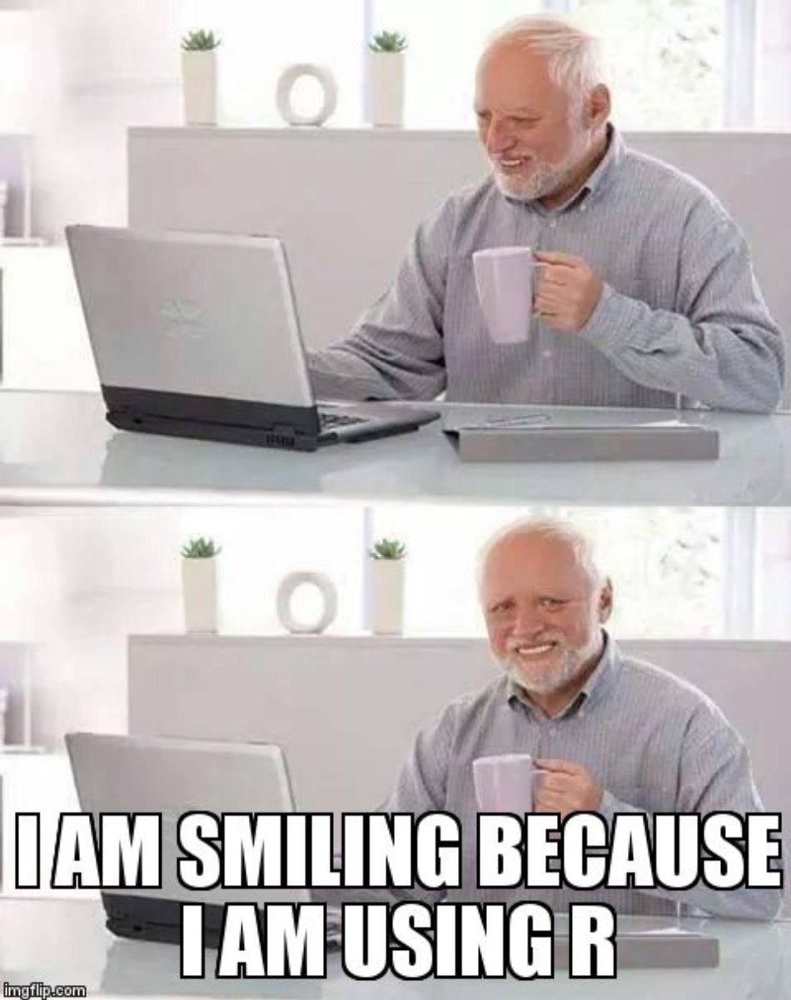
  </div>
</div>

---
class: middle
## Sobre el curso 
**Módulos:**
- **Módulo 1 — Fundamentos de R y tidyverse**: instalar, consola, scripts, primeros pasos.  
- **Módulo 2 — Manipulación de datos**: dplyr, tidyr — transformar y preparar datos.  
- **Módulo 3 — Visualización con ggplot2**: gramática, facetas, escalas, publicación.  
- **Módulo 4 — Análisis aplicado y reportes reproducibles**: regresiones básicas, R Markdown/Quarto, entregar results reproducibles.  

**Evaluación:** ejercicios prácticos en clase y entregas (scripts/rmarkdown).  
(Nota: siempre orientado a *hacer*.)

---
class: middle
# ¿Por qué R? 

<div style="display:flex; align-items:flex-start; gap:20px;">
  <div style="flex:1; min-width:260px;">
    <ul>
      <li><strong>Gratis</strong> y de código abierto.</li>
       <li><strong>Comunidad</strong> grande y activa.</li>
      <li><strong>Estándar</strong> en análisis y visualización en investigación.</li>
      <li><strong>Paquetes</strong> muy útiles (tidyverse, ggplot2, broom, etc.).</li>
      <li><strong>Reproducibilidad</strong>: informes (R Markdown / Quarto) que combinan texto, código y resultados.</li>
    </ul>
  </div>

  <div style="width:36%; max-width:400px;">
    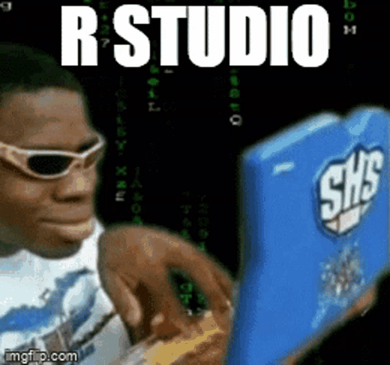
  </div>
</div>


---
class: middle
# ¿Qué haremos con R?

- **Visualizar** datos para explorar patrones y contar historias.  
- **Transformar** datos (limpiar, combinar, resumir) con `dplyr` y `tidyr`.  
- **Documentar** y **entregar** análisis reproducibles.
.center[

]
---
class: middle
# Instalación de R y RStudio

1. Instalar R desde CRAN: https://cran.r-project.org/
2. Instalar RStudio Desktop: https://posit.co/download/rstudio-desktop/
3. (Opcional) Instalar Git: https://git-scm.com/downloads

---
class: middle
# Primeros pasos en RStudio

- **Paneles**: consola, script, entorno, archivos/plots/help.
.center[
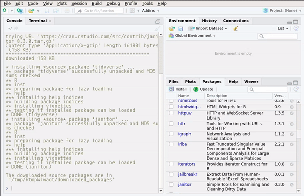
]
---
class: middle
# Primeros pasos en RStudio
- **Consola**: ejecutar comandos R directamente.
.center[
```r
1+1+1
3*5
x <- 10
```
]
---
class: middle
# Primeros pasos en RStudio
- **Script**: escribir, guardar y ejecutar bloques de código.

.center[
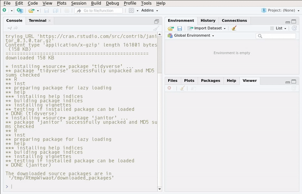
]

---
class: middle
# Primeros pasos en RStudio

- **Entorno**: ver objetos creados (environment)
.center[
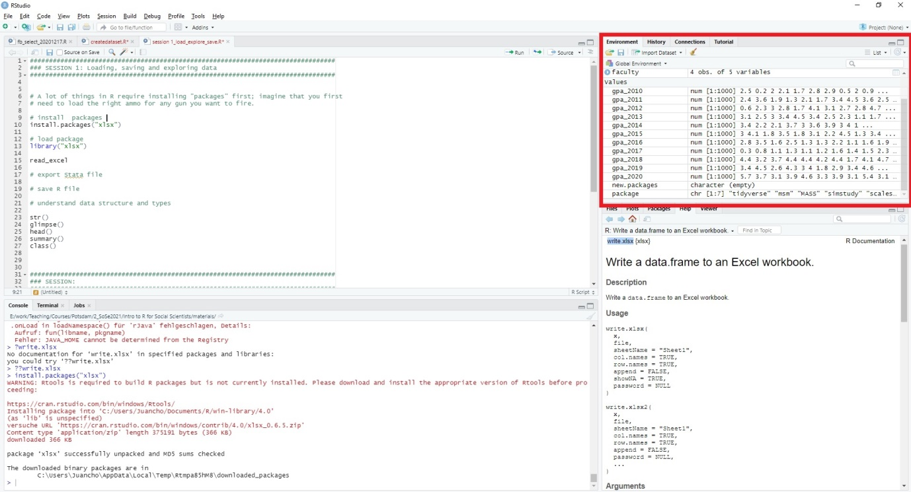
]

---
class: middle
# Primeros pasos en RStudio
- **Archivos/Plots/Packages/Help**: gestionar archivos, ver gráficos, instalar paquetes y buscar ayuda.

.center[
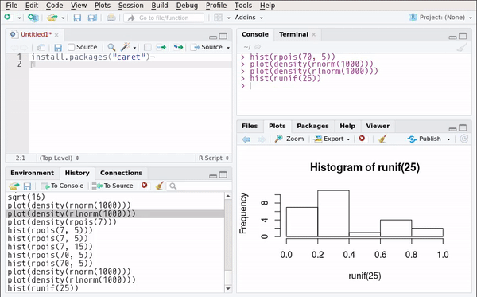
]
---
class: middle
# Primeros pasos en RStudio

- **Proyectos**: organizar trabajo en carpetas separadas.
.center[
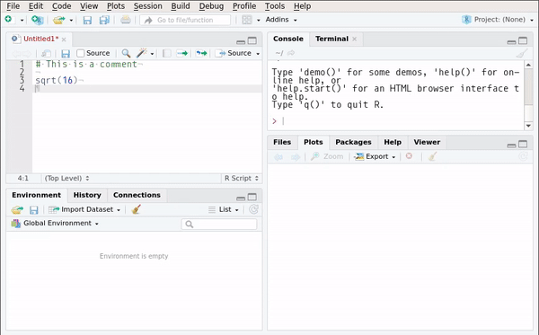
]

---
class: middle
# Primeros pasos en RStudio

- **Paquetes**: instalar y cargar paquetes  (e.g., `tidyverse`).
- **Librerías**: colecciones de funciones y datos (e.g., `ggplot2`, `dplyr`).

.center[
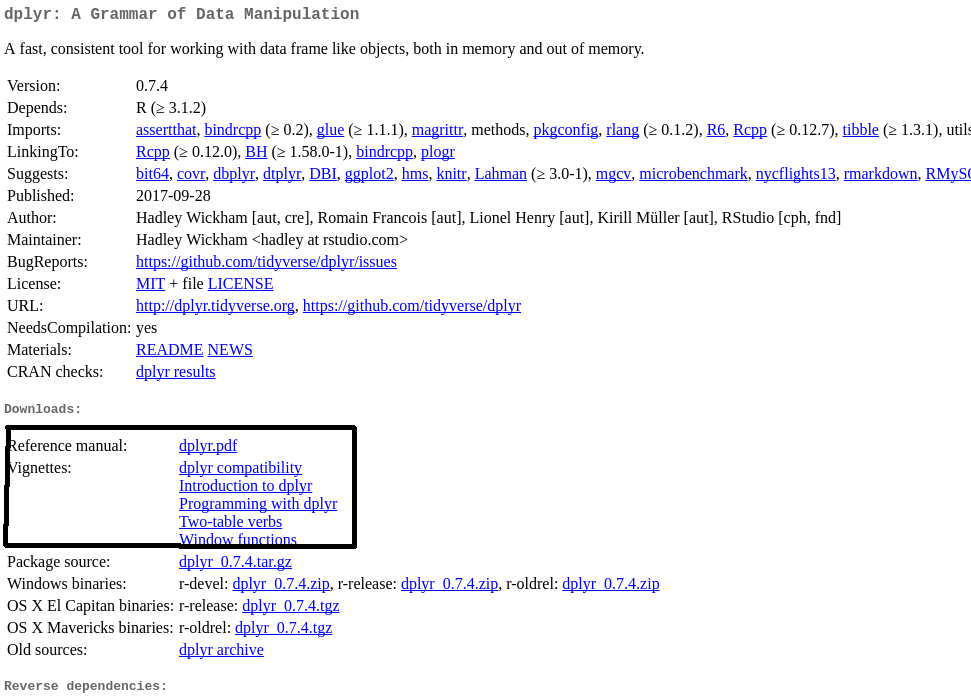
]


---
class: middle
# Primeros pasos en RStudio

- **Atajos de teclado**: acelerar flujo de trabajo (e.g., `Ctrl + Enter` para ejecutar línea actual).

.center[
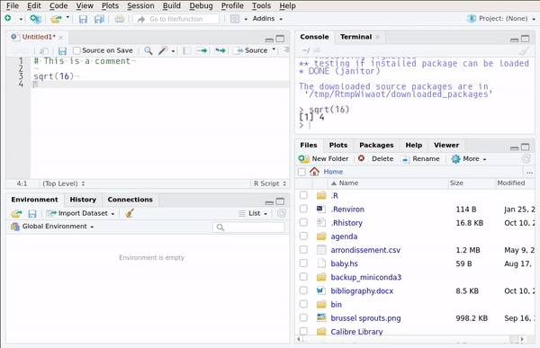
]
---
class: middle
# Primeros pasos en RStudio
- **R Markdown/Quarto**: crear documentos que combinan texto, código y resultados.
 https://www.jumpingrivers.com/blog/quarto-rmarkdown-comparison

---
class: middle
# Primeros pasos en RStudio

- **Ayuda**: usar `?función` o `help("función")` para obtener documentación.
.center[
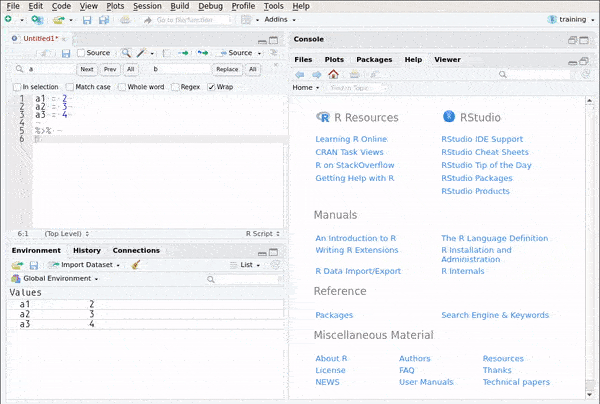
]
---
class: middle
# Primeros pasos en RStudio
- **Optiones**: personalizar RStudio en `Tools > Global Options`.
.center[
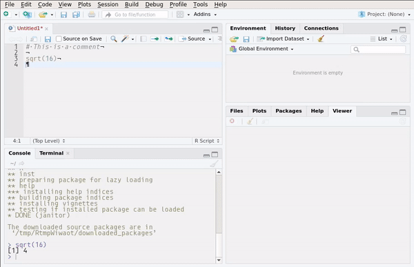
]

---
# Setear RStudio
- Ir a `Tools > Global Options > General`.
- Cambiar `Default working directory` a la carpeta donde guardarán sus proyectos.
- Marcar `Restore .RData into workspace at startup` (opcional).

## Otras opciones
getwd()  # ver directorio actual
setwd("ruta/a/tu/carpeta")  # cambiar directorio
::here()  # usar paquete here para rutas relativas

---
# Trabajar con proyectos
- Usar proyectos para organizar trabajo.
- Crear nuevo proyecto en `File > New Project`.
- Cada proyecto tiene su propio directorio de trabajo y configuración.
- Facilita cambiar entre diferentes análisis y mantener archivos organizados.
- Recomiendo usar proyectos desde el inicio.
- Verificar directorio con getwd().


---
class: center, middle
# Objetos y clases en R

> Todos los datos en R son *objetos*. Cada objeto tiene una **clase** (comportamiento) y un **tipo** (representación). 


---
class: middle
# Numéricos / Integer (class numeric / integer)

- Uso: cálculos, estadísticas, modelos.


numeric es por defecto (float); si necesitas entero explícito: 5L o as.integer().
a <- 3.14
class(a)         # "numeric"
b <- 5L
class(b)         # "integer"
is.numeric(a)    # TRUE
as.integer(a)

---
class:middle
## Objetos en R

- **Tipos básicos**: numéricos, caracteres, lógicos.
- **Estructuras**: vectores, listas, data frames, matrices.
- **Asignación**: `<-`, `=`, `->`.
```{r}
a <- 10
b = 20
c(1, 2, 3) -> v
```

---
---
class: middle
## Que es tidyverse?
- Colección de paquetes para manipulación y visualización de datos.
- Incluye `dplyr`, `ggplot2`, `tidyr`, `readr`, entre otros.
- Enfoque en gramática coherente y fácil de aprender.

```{r}
#install.packages("tidyverse")
#library(tidyverse)
```

---
class: middle
#Gramatica r base vs tidyverse
```{r}
# R base
#data <- data.frame(x = 1:5, y = rnorm(5))
#mean(data$y)
## Tidyverse
#data <- tibble(x = 1:5, y = rnorm(5))
#data %>% summarize(mean_y = mean(y))
```


---
class: center, middle
## Recursos para aprender R
- [R for Data Science](https://r4ds.had.co.nz/) (libro gratuito en línea)
- [RStudio Cheatsheets](https://rstudio.com/resources/cheatsheets/) (hojas de referencia rápida)
- [Tidyverse](https://www.tidyverse.org/) (colección de paquetes para manipulación y visualización)
---
class: center, middle

# **Dudas o comentarios**


---
class: middle right
background-image: url('portada.jpg')
background-size: cover


### Esta presentación fue realizada con el paquete  [Xaringan](https://slides.yihui.org/xaringan), diseñado para entorno  [R](https://www.r-project.org/) 


